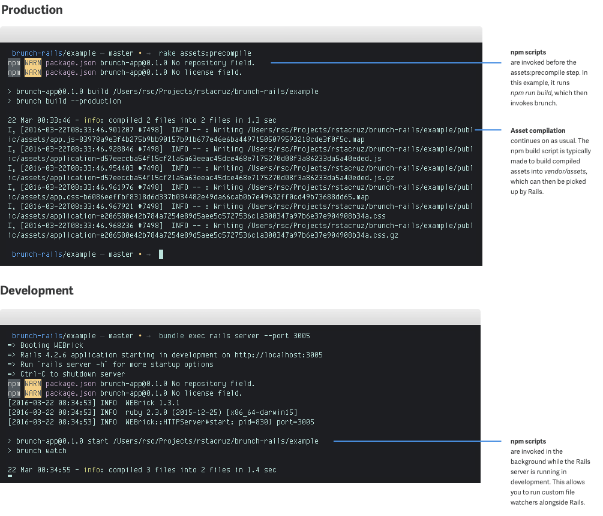

# npm-pipeline-rails

> Use npm as part of your Rails asset pipeline

npm-pipeline-rails allows you to use any toolchain to bulid your asset files in [Rails] 4.2+. This allows you to:

- Use [Brunch][] with Rails ([instructions](docs/brunch.md))
- Use [Gulp][] with Rails ([instructions](docs/gulp.md))
- Use [Grunt][] with Rails
- Use [Browserify][] with Rails
- Use [Broccoli][] with Rails
- Use any other asset tool with Rails

[Rails]: http://rubyonrails.org/
[Webpack]: https://webpack.github.io/
[Brunch]: http://brunch.io/
[Browserify]: http://browserify.org/
[Gulp]: http://gulpjs.com/
[Grunt]: http://gruntjs.com/

<br>



> _See [§ How it Works](#how-it-works) for an explanation of the diagram above._

<br>

[Broccoli]: https://github.com/broccolijs/broccoli

## Usage

Add this line below to your `Gemfile`. After that, proceed with an automated or manual setup.

```rb
gem 'npm-pipeline-rails'
```

#### Automated setup

Use the generators for your preferred build tool:

- __[Brunch](docs/brunch.md)__ - `./bin/rails generate npm_pipeline:brunch`
- __[Gulp](docs/gulp.md)__ - `./bin/rails generate npm_pipeline:gulp`

#### Manual setup

* Put together a setup with [Brunch], [Broccoli], [Gulp], or any other tool. It should:
  * Take source files from `app/brunch/`
  * Render JS to `vendor/assets/stylesheets/brunch/`
  * Render CSS to `vendor/assets/javascripts/brunch/`
  * _(Replace `brunch` with whatever build tool you use.)_
* Create a `package.json` with `start` and `build` scripts to point to this setup. ([See example](lib/generators/npm_pipeline/brunch/package.json))
  * `start` - Configure this script to run a development file watcher.
  * `build` - Configure this script to run a production compiler.
* Add your expected compiled assets to `.gitignore`.

#### Set up support for tests

If you're using continuous integration for your tests, configure it to run this before your tests:

```sh
npm run build
```

For tests running in your development machine, ensure that asset files are available when running your tests. This means starting your dev server at least once before running tests, or invoking `npm run build` manually.

#### Disable some gems

You may also want to disable some gems, depending on your set up:

- Disable `uglifyjs` if you already do minification in your npm tool.
- Disable `autoprefixer-rails` if you already do autoprefixing in your npm tool.
- Disable `sprockets-es6` if you already do ES6 compiling in your npm tool.
- _and so on..._

<br>

## Heroku

When deploying to [Heroku](https://heroku.com), use [Node.js](https://github.com/heroku/heroku-buildpack-nodejs) and [Ruby](https://github.com/heroku/heroku-buildpack-ruby) buildpacks together. See: [Using Multiple Buildpacks for an App](https://devcenter.heroku.com/articles/using-multiple-buildpacks-for-an-app) *(devcenter.heroku.com)*

```sh
$ heroku buildpacks:set heroku/ruby
$ heroku buildpacks:add --index 1 heroku/nodejs

Buildpack added. Next release on my-app-name will use:
  1. heroku/nodejs
  2. heroku/ruby
```

It's recommended to turn off `config.npm.install_on_asset_precompile` to make deployments faster; see [§ Configuration](#configuration).

<br>

## Configuration

npm-pipeline-rails provides these configuration options:

```rb
# These are defaults; in most cases, you don't need to configure anything.

Rails.application.configure do
  # Enables npm_pipeline_rails's invocation of `watch` commands. (v1.5.0+)
  # If `true`, watch commands will be ran alongside Rails's server.
  # Defaults to true in development.
  config.npm.enable_watch = Rails.env.development?

  # Command to install dependencies
  config.npm.install = ['npm install']

  # Command to build production assets
  config.npm.build = ['npm run build']

  # Command to start a file watcher
  config.npm.watch = ['npm run start']

  # The commands are arrays; you may add more commands as needed:
  config.npm.watch = [
    'npm run webpack:start',
    'npm run brunch:start'
  ]

  # If 'true', runs 'npm install' on 'rake assets:precompile'. (v1.6.0+)
  # This is generally desired, but you may set this to false when
  # deploying to Heroku to speed things up.
  config.npm.install_on_asset_precompile = true
end
```

<br>

## How it works

npm-pipeline-rails allows you to hook certain commands, usually npm scripts, during the Rails app lifecycle. It assumes that your tool will build plain JS and CSS files into `vendor/assets`, allowing it to be picked up by Rails's asset pipeline.

It does __not__ replace the Rails asset pipeline, but rather it works with it. The files you build with your npm pipeline will be available as regular files in the Rails asset pipeline.

#### In development

When starting a Rails development server (`bundle exec rails s`), it runs the `install` command. After that, it starts a background process that runs your `watch` command.

#### In production

When running `rake assets:precompile`, it will first run the `install` command then the `build` command.

#### More info

Consult [railtie.rb](https://github.com/rstacruz/npm-pipeline-rails/blob/master/lib/npm-pipeline-rails/railtie.rb) for the actual code that makes all these happen.

<br>

## Skipping Rails asset pipeline

The recommended setup renders files to `vendor/assets/stylesheets/brunch/` and `vendor/assets/javascripts/brunch/`. (Replace `brunch` with whatever build tool you use.) You may opt to output to `public/assets/stylesheets/` and `public/assets/javascripts/` instead.

This is not recommended since you will miss out on automatic asset fingerprinting, among other nice integrations.

If you do this, you will need to run `npm run build` as part of your deploy script and CI test script.

<br>

## Motivation

Rails's asset pipeline was a great step forward for Rails 3. For today's requirements however, it doesn't always come with all the tools you need. npm-pipeline-rails lets you outsource asset building complexities to Node.js-based tools.

> __[Read more →](docs/motivation.md)__

<br>

## Also see

- [webpack-assets](https://github.com/toptal/webpack-assets) - integration for webpack-dev-server
- [browserify-rails](https://rubygems.org/gems/browserify-rails) - browserify for the asset pipeline

## Thanks

**npm-pipeline-rails** © 2016+, Rico Sta. Cruz. Released under the [MIT] License.<br>
Authored and maintained by Rico Sta. Cruz with help from contributors ([list][contributors]).

> [ricostacruz.com](http://ricostacruz.com) &nbsp;&middot;&nbsp;
> GitHub [@rstacruz](https://github.com/rstacruz) &nbsp;&middot;&nbsp;
> Twitter [@rstacruz](https://twitter.com/rstacruz)

[MIT]: http://mit-license.org/
[contributors]: http://github.com/rstacruz/npm-pipeline-rails/contributors
